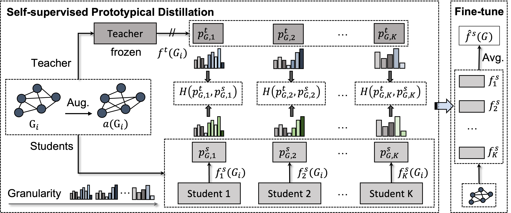

# From Coarse to Fine: Enable Comprehensive Graph Self-supervised Learning with Multi-granular Semantic Ensemble



This is the official implementaiton of the paper **From Coarse to Fine: Enable Comprehensive Graph Self-supervised Learning with Multi-granular Semantic Ensemble** published in ICML 2024. Our paper can be found at [Openreivew Link](https://openreview.net/pdf?id=JnA9IveEwg). 

### Dependency 

The packages we use include,

```shell
- python >= 3.8.5
- Pytorch >= 1.10.1
- PyTorch Geometric == 2.0.4;
- PyGCL == 0.1.2
- Numpy >= 1.20.1
- pandas 
- scikit-learn >= 0.24.1
- wandb
- tqdm
- rdkit
```

Please also install [faiss](https://github.com/facebookresearch/faiss/tree/main) if you want to run the hierarchical K-means clustering. 

### Instruction 

#### Dataset Preparation:

We follow the instruction of [Pre-training GNNs](https://github.com/snap-stanford/pretrain-gnns) to prepare the datasets in chemistry and biology domain. All the datasets can be downloaded from the [project page](https://snap.stanford.edu/gnn-pretrain/).

#### Pre-training:

First, we need to create a folder for storing pre-triained teacher model checkpoint in the root direction of this project. 

```shell
mkdir pretrain
```

Then, given the specfic pre-trained teacher model, like [GraphCL](https://github.com/Shen-Lab/GraphCL), we need to download its pre-trained model checkpoint and save it in the foler. After that, we can run the following command to train the student models. 

```python
python src/models/MGSE/pretrain.py --teacher_model graphcl
```

#### Fine-tuning

Finally, we can run the following command to fine-tune the student models on the downstream datasets (e.g., bbbp) and do the evaluation. 

```python
python src/models/MGSE/finetune.py --dataset bbbp
```

### Citation 

Please cite our work if you find it useful:

```bibtex
@inproceedings{
wen2024from,
title={From Coarse to Fine: Enable Comprehensive Graph Self-supervised Learning with Multi-granular Semantic Ensemble},
author={Qianlong Wen and Mingxuan Ju and Zhongyu Ouyang and Chuxu Zhang and Yanfang Ye},
booktitle={Forty-first International Conference on Machine Learning},
year={2024}
}
```

